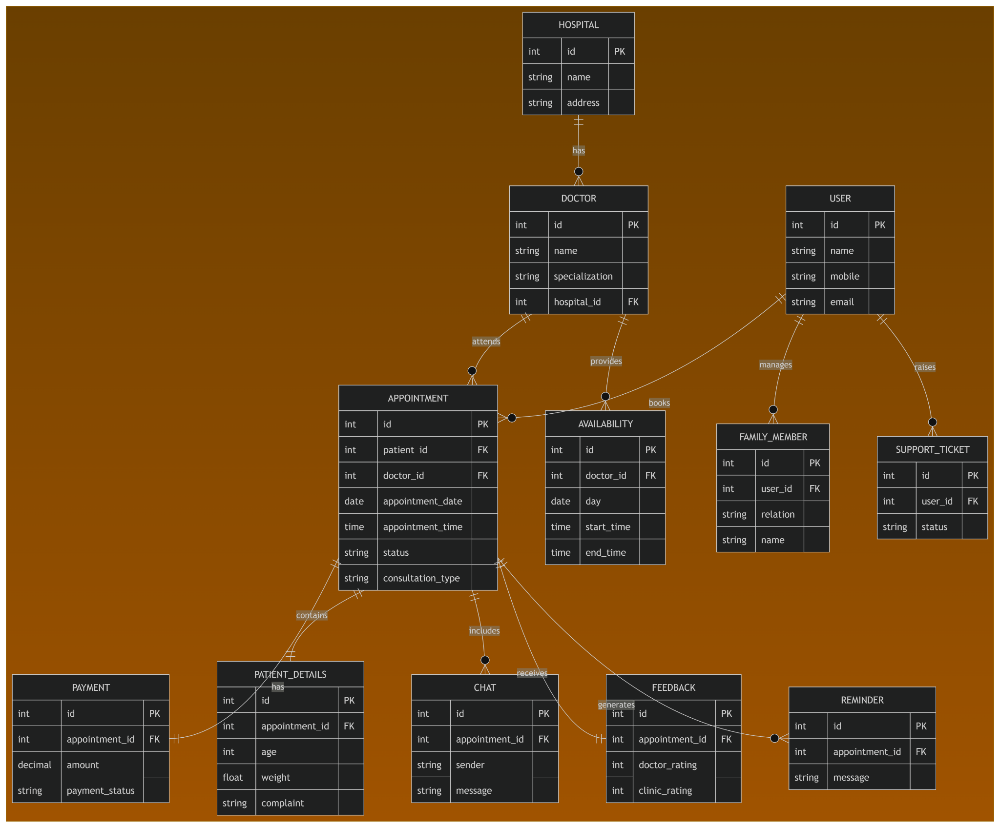

# Schedula Backend

Backend API for the **Schedula - Doctor Appointment Booking System** built using **NestJS** and **TypeScript**.

## 🚀 Tech Stack

- NestJS
- TypeScript
- Node.js
- npm

## 📂 Project Structure

```
schedula-ramkrushna-zende/
├── docs/
│   └── ERDiagram.png
├── src/
├── test/
├── package.json
├── tsconfig.json
├── nest-cli.json
└── README.md
```

## ⚙️ Installation

Clone the repository:

```bash
git clone https://github.com/ramzende14/schedula-ramkrushna-zende.git
```

Go to the project directory:

```bash
cd schedula-ramkrushna-zende
```

Install dependencies:

```bash
npm install
```

## ▶️ Run the Project

Development mode:

```bash
npm run start:dev
```

Production mode:

```bash
npm run start:prod
```

The application will run at:

```
http://localhost:3000
```

## 📊 ER Diagram

The ER Diagram for the database design is available below:



## 🌿 Git Workflow

- Main Branch: `main`
- Feature Branch: `feature/project-setup`

## 👨‍💻 Author

**Ramkrushna Zende**

GitHub: https://github.com/ramzende14
